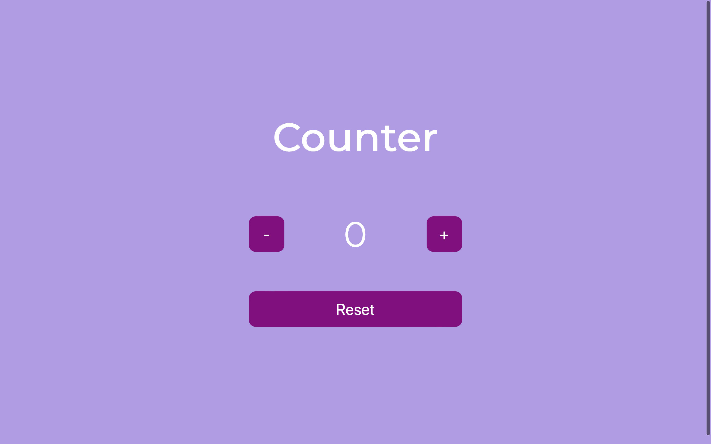

# BASIC COUNTER WEB APP

This project has been created for the JavaScript Basics course of [start2impact University](https://www.start2impact.it).

This is a simple JavaScript application that allows users to increment, decrement, and reset a counter value. 

Upon entering the page, the counter is initialized at 0. The application provides three buttons to manipulate the counter: one to increase the value, one to decrease it, and one to reset it.

The entire user interface is built using only JavaScript, manipulating the DOM to dynamically create the counter display and the buttons. No frameworks or libraries such as jQuery, React, or Angular are used in the development of this application. 

The logic for modifying the counter and ensuring it doesn't go negative is implemented in JavaScript, while the visual design and styling are handled through CSS.

---

## Features

* Increment counter value with the "+" button.
* Decrement counter value with the "-" button (with a check to prevent negative values).
* Reset the counter value to 0.
* Dynamic creation of all HTML elements (buttons, counter display) using JavaScript.
* Styling and layout handled with CSS.

## Link

[Basic Counter](https://jsbasic-counter.netlify.app)

